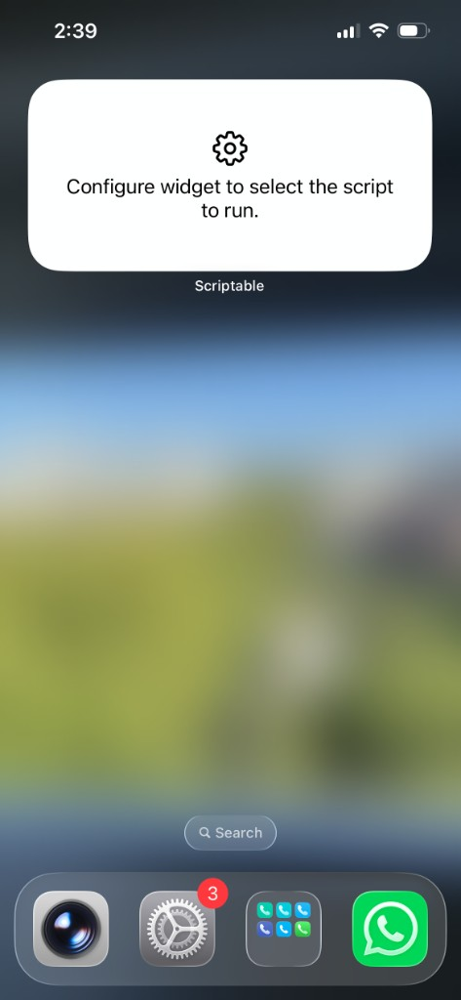
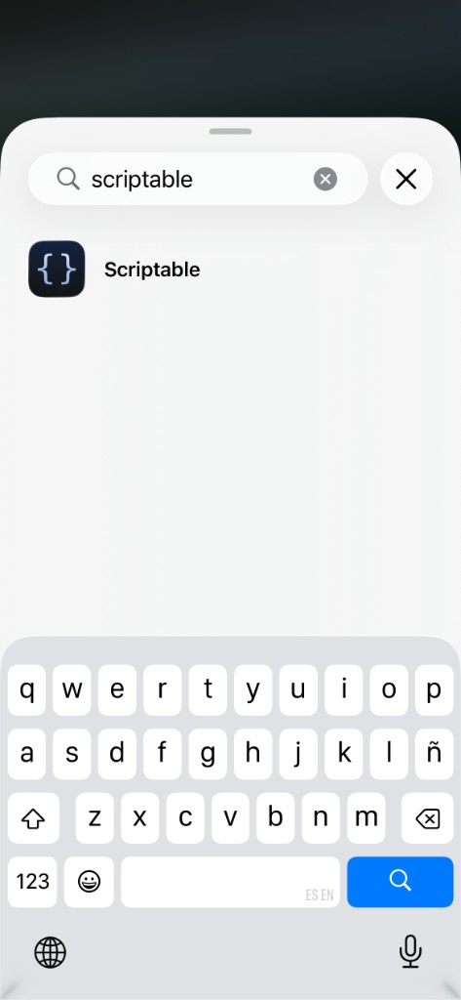
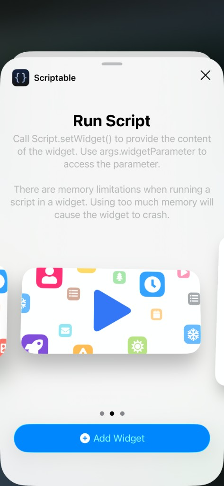
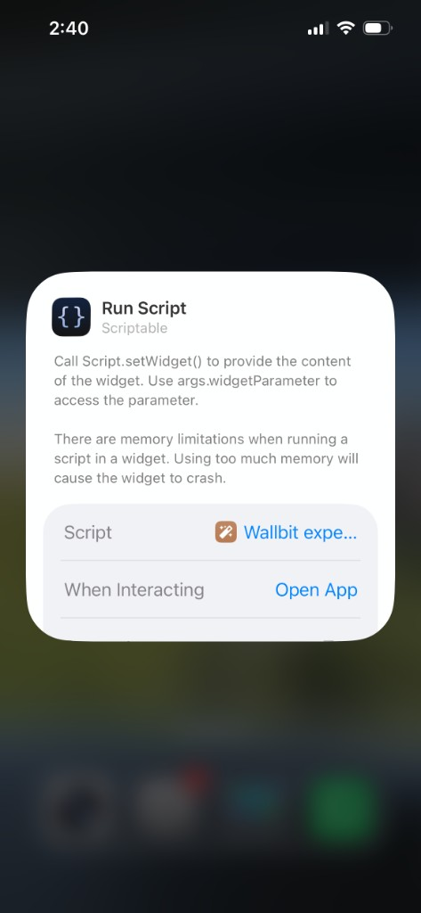
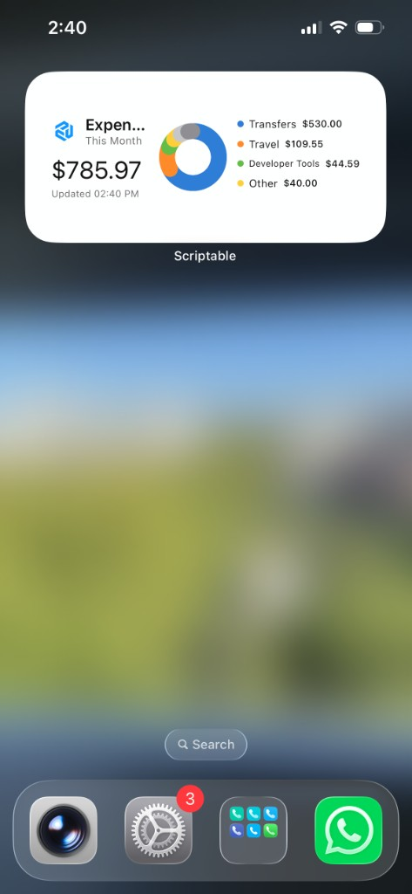

# Wallbit Expenses Widget


An iPhone Home Screen widget for [Scriptable](https://scriptable.app/) that shows Wallbit expenses grouped by category.

The widget uses the Wallbit public API, stores your API key in the iOS Keychain, and renders native-looking small, medium, and large widget layouts with a donut chart, category totals, and weekly spending bars.

## Features

- Fetches completed transactions from `GET https://api.wallbit.io/api/public/v1/transactions`.
- Stores your Wallbit API key securely in Scriptable's Keychain.
- Shows expenses for the current month.
- Groups transactions into local categories using configurable keyword rules.
- Supports small, medium, and large widgets.
- Adapts to iOS light and dark mode.
- Uses WidgetKit refresh scheduling through Scriptable.

## Requirements

- An iPhone with [Scriptable](https://scriptable.app/) installed.
- A Wallbit account.
- A Wallbit API key with `read` permission.

Create the API key in Wallbit under `Settings -> API Keys`. The widget only needs the `read` permission because it only reads transactions.

## Installation

1. Open Scriptable on your iPhone.
2. Create a new script named `Wallbit Expenses`.
3. Copy the contents of `wallbit-widget.js` into the new Scriptable script.
4. Run the script once inside Scriptable.
5. Paste your Wallbit API key when prompted.
6. Add a Scriptable widget to your Home Screen.
7. Long-press the widget, choose `Edit Widget`, and select `Wallbit Expenses` as the script.

The medium widget is a good default. The small widget is more compact, and the large widget shows more detail.

## Add the Widget to Your Home Screen

After creating and running the Scriptable script once, add the widget to your Home Screen:

1. Add a Scriptable widget to your Home Screen. At first, it will ask you to configure which script to run.



1. If you do not see Scriptable in the widget picker, search for `Scriptable`.



1. Choose the Scriptable `Run Script` widget size you want and tap `Add Widget`.



1. Long-press the widget, tap `Edit Widget`, and select your `Wallbit Expenses` script.



1. The widget should now render your Wallbit expenses on the Home Screen.



## Configuration

The main options are at the top of `wallbit-widget.js`:

```javascript
const CONFIG = {
  currency: "USD",
  refreshMinutes: 30,
  maxPages: 5,
  pageLimit: 50,
  topCategories: 3,
  locale: "en-US",
};
```

To customize categories, edit `CATEGORY_RULES`:

```javascript
{
  category: "Transport",
  keywords: ["uber", "cabify", "taxi", "lyft", "sube", "metro", "bus"],
}
```

The script searches for those keywords in transaction fields such as `type`, `external_address`, `comment`, and currency codes.

## Tracked Categories

The widget categorizes transactions locally with keyword rules. Current categories are:

- `Transfers`: `WITHDRAWAL_LOCAL`, `transfer`, `wire`, `ACH`, `Brubank`, `MercadoPago`, `Galicia`.
- `Travel`: `Airbnb`, hotels, bookings, hostels, lodging, flights, airlines.
- `Developer Tools`: `Vercel`, `Railway`, `Cursor`, `OpenAI`, `ScreenStudio`, `CapCut`, `Nokia of America`, `Refero`.
- `Transport`: `Uber`, `Cabify`, taxis, `SUBE`, metro, bus, `YPF`.
- `Food & Coffee`: restaurants, cafes, `McDonald's`, `Havanna`, `Rapanui`, `Rodziny`, `Rufian`, `Barra Recreo`, `Up Town`, `Las Ernestinas`, `Le Utthe`, `Inner Company`.
- `Groceries`: supermarkets and markets such as `Cencosud`, `Mercadito`, `Carrefour`, `Coto`, `Jumbo`, `Walmart`.
- `Subscriptions`: `Spotify`, `Netflix`, `Apple`, `Google`, `YouTube`, `Claude.ai Subscription`.
- `Shopping`: `Amazon`, `MercadoLibre`, shops, stores, `Zara`, `Ay Not Dead`.
- `Health`: pharmacies and healthcare merchants such as `Farmacity`, pharmacy, doctor, hospital, clinic.
- `Utilities`: electricity, gas, internet, phone, and utility/service payments.
- `Rewards`: cashback and reward transactions such as `CASHBACK_ACCUMULATED`.
- `Fees`: fees, commissions, and related charges.

## Security

Do not paste your Wallbit API key into the source code.

The script asks for your API key the first time it runs and saves it in the iOS Keychain using Scriptable's `Keychain` API. The key is not committed to this repository.

To rotate your API key:

1. Revoke the old key in Wallbit.
2. Create a new Wallbit API key with `read` permission.
3. Change `apiKeychainKey` in the script, or delete the old `wallbit_api_key` value from Scriptable's Keychain if you manage Keychain values manually.
4. Run the script again and paste the new key.

## Limitations

Wallbit transactions do not currently expose a dedicated expense category field in the public transaction response used by this widget. Categories are inferred locally from keyword rules.

iOS Home Screen widgets are not real-time. Scriptable runs on top of WidgetKit, and iOS ultimately decides how often widgets refresh. This script requests a refresh every 30 minutes, but the system may delay updates to preserve battery.

## Project Structure

```text
wallbit-widget.js
assets/
  01-unconfigured-widget.png
  02-search-scriptable.png
  03-add-scriptable-widget.png
  04-select-script.png
  05-widget-ready.png
```

## License

MIT